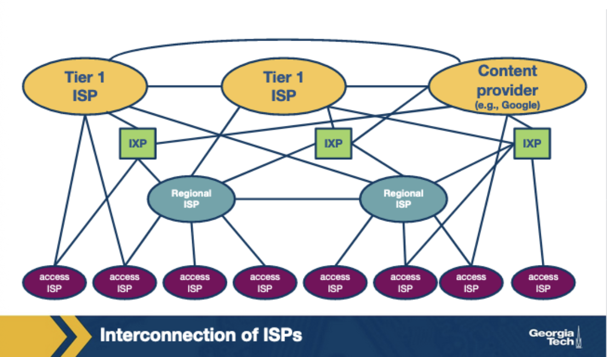
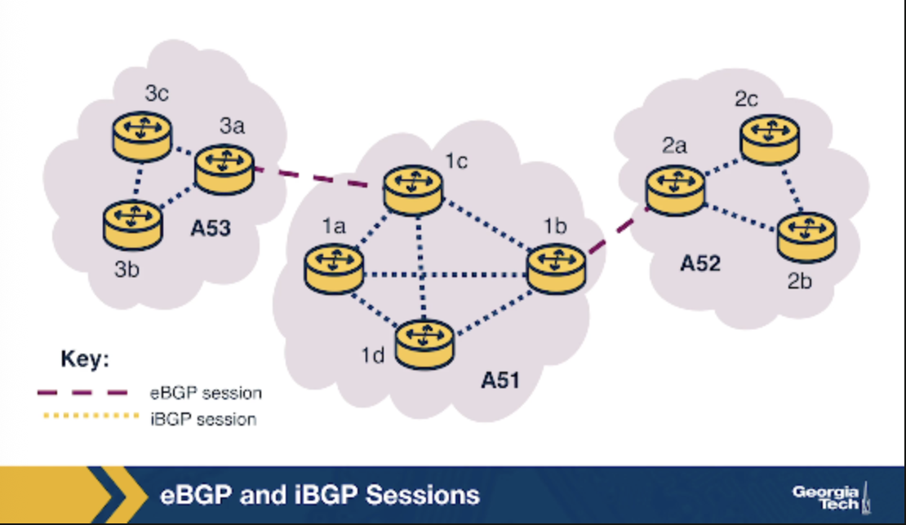
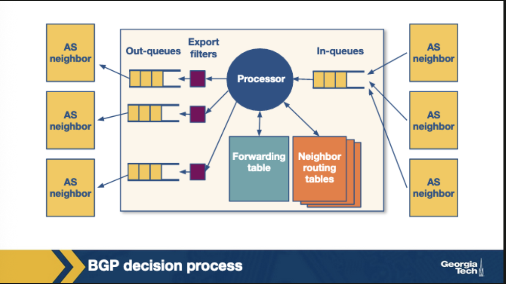
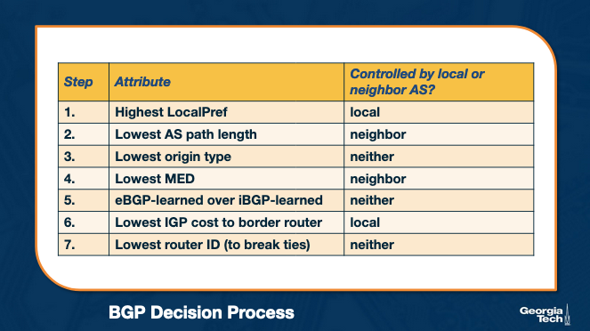
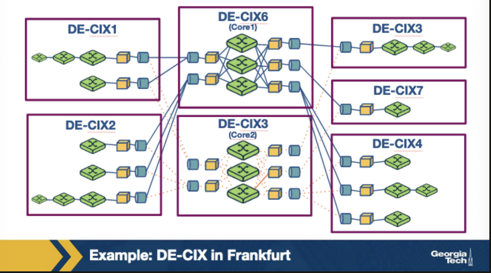

# Internet Ecosystem & AS Routing Policies — Review Notes

## Internet Structure

* **Internet = network of networks**, composed of:

  * **ISPs (Internet Service Providers)**

    * **Tier-1 (Global ISPs)**: backbone of the Internet (e.g., AT\&T, NTT, Level-3).
    * **Tier-2 (Regional ISPs)**: connect Tier-3 ISPs to Tier-1 ISPs.
    * **Tier-3 (Access ISPs)**: connect homes/businesses to the Internet.
  * **IXPs (Internet Exchange Points)**: physical infrastructure where networks interconnect locally.
  * **CDNs (Content Delivery Networks)**: networks owned by content providers (e.g., Google, Netflix) with globally distributed data centers.

* **Trend:** Internet evolving from hierarchical (Tier-3 → Tier-2 → Tier-1) to flatter (due to IXPs + CDNs).

---

## Autonomous Systems (AS)

* **AS = Autonomous System**:

  * A group of IP networks and routers under a single administrative authority.
    - could be a CDN or an ISP (example from lecture)
    - however an ISP may operate as a single AS or through multiple, same for CDN
  * Runs consistent internal routing policy.
    - What do we mean by this?
      - The AS decides which routes to import and which routes to export.
      - inside the AS itself, routers use IGP:
        - interior gateway protocol
        - determines shortest paths
        - iBGP also used (external routes consistency)
  - Decides how traffic enters and leaves itself
  * Identified by a unique **ASN (Autonomous System Number)**.
* **Examples**:

  * Google: AS15169
    - google decides that all traffic leaving network should leave through their own global backbone rather than a peer
      - this is what is meant by **consistent** internal routing policy
  * Netflix: AS2906
  * Comcast: AS7922
  * MIT: AS3

---

## Routing Protocols

* **Within an AS (Intra-domain): Interior Gateway Protocols (IGPs)**

  * OSPF, IS-IS → link-state algorithms.
    - these are aware of the topology of the network (ex: Dijikstra's on OSPF)
  * RIP → distance vector (Bellman-Ford).
    - often distributed, asynchronized, decentralized. 
    - not aware of network topology at each step
  * EIGRP → Cisco proprietary.
  * Goal: **shortest/cheapest** path within the AS.

* **Between ASes (Inter-domain): Exterior Gateway Protocol (EGP)**

  * **BGP (Border Gateway Protocol)**.
    - **border** routers of an AS use BGP to exchange info with each other
  * **Path vector protocol**: advertisements include full AS-path.
  * **Loop avoidance:** reject routes containing own AS number.
  * **Policy-based routing**: decisions driven by business/economics, not shortest path.

---

## Business Relationships Between ASes

* **Provider–Customer (Transit):**
  - also called Transit
  * Customer pays provider for global Internet connectivity.
  * Provider forwards all customer traffic both ways.
  - Example: local ISP in smalltown paying regional ISP to forward all traffic both ways for its clients, the small town ISP is a customer of the provider (regional USP)
  - Why? Small town ISP doesn't have direct connection to youtube, amazon.com, etc. that clients are trying to access. 

* **Peering:**

  * Settlement-free exchange of traffic between two ASes.
  * Routes shared typically limited to each AS’s customers.
  * Must be balanced, as **asymmetric** traffic discouraged.
  * Common at IXPs; Tier-1 ISPs peer only with *equals*.
    - Otherwise larger ISP lacks incentive to enter peering relationship with smaller provider. 
  - When two small ISPs peer, they save money that would otherwise have to pay to their own providers to forward that traffic. this works best when two small ISPs share common traffic (destined for each others customers)
  - TODO: look into peer to peer networks

* **Billing models for transit:**

  * Fixed price (flat fee within bandwidth cap).
  * Usage-based (95th percentile billing over sampled usage).

---

## Exporting Routes (What AS advertises outward)

- deciding on routes is a policy decision
- once a route is advertised, other AS will send traffic through there. 
- Route filters:
  - determine **which** routes an AS router should advertise to neighboring AS routers. 

* **From customers:** advertise **to everyone** (providers, peers, other customers).
  - AS (call it X) is getting paid to provide reachability to this customer route, so it will advertise it as widely as possible
* **From providers:** advertise **only to customers**, not peers/providers.
  - does not make money for X to advertise widely since it has no incentive to carry traffic for its providers routs
  - withheld from other providers and peers, but offered to customers
  - won't route for free, basically
* **From peers:** advertise **only to customers**, not providers/peers.
  - same as the second scenario, but for peers. 
* **Goal:** maximize revenue, avoid being free transit.

---

## Importing Routes (What AS accepts for its routing table)

- AS are also selective about which routes to import. 
- Also based on incoming AS business relationship
- when it recieves multiple route advertisements to the same destination, the AS will rank in this preference order:
* **Preference order:**

  1. **Customer routes** → revenue (preferred).
    - wants to ensure routes towards its cusomters do not traverse other ASes, generating extra cost. 
  2. **Peer routes** → free under peering.
    - uses routes learned from peers as these are free under the peering agreements
  3. **Provider routes** → cost money (least preferred).
    - only done when it is essential for connectivity since this costs money. 
* **Goal:** minimize costs, maintain full connectivity.

---

## Comparisons of Routing Algorithms and Policies:

* **Spanning Tree Protocol (STP):**

  * Layer 2, avoids loops by building a tree.
  * Purely structural, no policies.
* **Distance Vector (e.g., RIP):**

  * Intra-AS, hop-based shortest paths.
  * Algorithm: Bellman-Ford.
* **BGP (Path Vector):**

  * Inter-AS, policy-based routing.
  * Decisions reflect **business incentives** (customer > peer > provider).

---

# Core Principles

* **AS relationships dictate routing policies.**
* **Export policy:** share widely only when financially beneficial.
* **Import policy:** prefer routes that generate revenue or avoid cost.
* **BGP is the glue of the global Internet**, but it’s **economics > performance**.

# BGP Review Notes

## BGP Design Goals

* **Scalability**
  * Handle Internet growth: more ASes, more prefixes, more churn.
  * Ensure convergence in reasonable times.
  * Maintain loop-free paths.

* **Express Routing Policies**

  * Route attributes allow **import/export route filters** and ranking.
  * Each AS keeps decisions confidential and independent.
* **Allow Cooperation**

  * ASes interconnect but still make **local, independent decisions**.
* **Security**

  * Not part of original design.
  * Vulnerable to **misconfigurations and attacks**.
  * Research & proposals: S-BGP, registries for prefix ownership, PKI for ASes, ML-based detection.
  * Limited adoption due to transition cost & lack of incentives.

---

## BGP Protocol Basics

* **BGP peers** exchange routing info over **semi-permanent TCP sessions**.

  * Initiated with an **OPEN** message.
  * Peers then exchange routing table entries.
  * Convergence can take seconds to minutes.
* **Types of BGP sessions**

  * **eBGP:** between routers in different ASes.
  * **iBGP:** between routers within the same AS.
* **BGP Messages**

  * **UPDATE:** route announcements + withdrawals.
    - announcements are messages that advertise new routes and updates to existing routes
    - withdrawals are messages that say a previously advertised route is not available
  * **KEEPALIVE:** maintain session state.

### Path Attributes and BGP Routes:
- reachable IP prefix field is advertised by the gateway routes using eBGP
* **Prefixes**
  * Destination = IP prefix (subnet or group of subnets).
  * Advertised by border routers via eBGP → disseminated inside AS via iBGP.
  - but there is also these attributes on advertised BGP routes:

* **Path Attributes**

  * **AS-PATH:** list of ASNs traversed; prevents loops; shorter paths often preferred.
    - if an AS sees itself in the list of AS traversed, it will reject it to stop loops from forming
    - if multiple routes to the same prefix exist, shorter AS PATH is picked
  * **NEXT-HOP:** IP address of next router toward destination.
    - tells router to send packet there first (next hop neighbor)
    - internal routers don't know the external world and depend on border routers
    - NEXT HOP tells them which border router to send outbound traffic to  
---

## iBGP vs eBGP Review

Subtle but crucial distinction 
both take care of disseminating external routes. 
* **eBGP**
  - runs between border routers of different ASes. 
  * External connectivity between border routers of different ASes.
  * Learns routes to external prefixes that border routers of an AS can reach. 
  - ex: router learns from AS2 that "I can reach this IP prefix:"
* **iBGP**
  * Internal distribution of externally learned routes inside an AS.
    - dissemnitates the same routes learned by the border routers through eBGP!
  * Requires **full mesh of iBGP sessions** between routers (each iBGP router peers with all others).
  * Not an IGP (like OSPF/RIP) → doesn’t compute paths, just **disseminates** external routes.
    - recall that IGP also decides routes based on certain costs. 

---

## BGP Decision Process
Since ASes run under different administrative domains, they operate with different traffic volumes and business goals. 
The routers mostly though, follow this process to select routes:

* **Step 1:** Apply **import policy** → filter routes.
  - routers gets incoming BGP messages and processes them 
  - if it gets an advertisement, it applies the import policies to excludes routes it should not consider based on import filters (discussed above)
* **Step 2:** Select **best route** based on attributes + policy.
* **Step 3:** Install route in forwarding table.
* **Step 4:** Apply **export policy** → decide what to advertise.
* **Default tie-breaker:** prefer route with shortest AS-PATH (if no policy specified).

Notice the **route filters** in the diagram

### Attributes used to influence decisions:
- suppose the routers gets multiple route advertisements to the same destination. 
how does the router choose which route to import in this case?
- if there is no policy in place, then the router uses the path length attribute to select shortest path (shortest number of hops)
  - but this rarely occurs in practice
it follows this order instead:

* **LocalPref (Local Preference):**
- say that there are routes through two ASes, but one of them has a peering relationship with the current AS. it can then assign a higher local pref to the AS it has a peering relationship with. 
  * Higher = more preferred.
  * Set by AS → influences **outbound traffic**.
  * Used to rank routes (customer > peer > provider).
  - the higher local pref AS is the "preferred/cheaper door to leave through"
  - with local pref, the number is set so:
    - customer routes have the highest pref as they make money
    - peer routes medium pref as theya re free
    - provider routes are lowest as tehy cost money

* **MED (Multi-Exit Discriminator):**
   set by the neighbor AS, suggests which entry point neighbor AS prefers when sending them traffic
  * Suggests preferred entry point for **inbound traffic** when multiple links exist.
  * Lower MED = more attractive. (inverse of localPref)
  * Typically set by neighboring AS.
  - neighbor AS is saying "please enter my network through this door"

### How are atrributes controlled?
- either set locally by the AS
  - localPref
- neighbor of AS
  - MED
- protocol 
  - if learned by ebgp or ibgp
---

## Routing Policies: Import/Export

* **Export**

  * **Customer routes:** advertise to everyone.
  * **Provider routes:** advertise only to customers.
  * **Peer routes:** advertise only to customers.
* **Import**

  * Preference order: **customer > peer > provider**.
  * Goal: maximize revenue, minimize costs.

---

## Challenges with BGP: Scalability and Miscnfigrations

* **Misconfigurations/faults** → instability, outages, large update storms.
* **Scalability issues** due to Internet growth.
* **Mitigations**: basically, limit the routing table size and limite the number of route changes
Filtering:
  * **Route aggregation:** filter long/specific prefixes.
  * **Prefix limits:** cap # of prefixes f*rom a single source* per session.
  * **Default routes:** used by small ASes.
    - small ASes can configure default routes into their forwarding tables
  * **Flap damping:** suppress unstable routes based on update frequency.
    - limit the number of routing changes
    - limit the propogation of unstable routes
    - AS will track the number of updates to a specific perdix over time. if a tracked value reaches a configuration val, AS will supress that route until a later time (rate limiting kind of)
    - this affects reachability, so the strategy is:
    - *specifc* prefixes should have lower thresholds 
    - while routes to destinatoins with high availability requirements could be allowed higher thresholds

---

## Internet Exchange Points (IXPs)
ASes can peer with each other directly, or they can peer at IXPs
IXP: physical place inside a data center where differetn AS connect directly to exchange traffic
important: they provide fully redundant fabric switch which provides fault tolerance

example IXP site ^

* **Definition:** Physical infrastructure where ASes interconnect + exchange traffic.
* **Structure:** Redundant switches in data centers.
* **Roles/Benefits**

  * Handle massive traffic volumes (50k+ peering links at large IXPs).
    - large IXPs in europe hace the comparable daily traffic volume of global Tier 1 ISPs
  * Improve **locality of traffic** → reduced delay, cost savings.
  * Mitigate DDoS attacks (e.g., Spamhaus 2013).
    - they play the role of a shield
  - research playground with real world infastructure
  * Act as **marketplaces + innovation hubs** (DDoS mitigation, SDN services).
* **How to peer at IXPs**

  * Public ASN required.
  * Bring router to IXP + connect to switch.
  * Must run BGP; must agree to General Terms & Conditions.
  * Costs: circuit setup + monthly port fee + membership (if required).
  * Peering is usually **settlement-free** (no per-traffic charges).

### IXP Services

* **Public peering:** via shared switch fabric, cheaper + efficient.
* **Private peering:** dedicated direct interconnect between two networks.
  - don;t use the IXPs public peerign ing\fastructure
* **Route servers:** enable multilateral peering without bilateral sessions.
* **Remote peering:** via resellers/partners for distant ASes.
  - allows remote located networks to access IXP services
* **Mobile peering:** interconnect for GPRS/3G networks.
* **DDoS blackholing:** filter attack traffic at the IXP.
* **Value-added services:** IRR, DNS root, ccTLD servers, NTP, etc.

---

## IXP Route Servers

* **Purpose:** reduce complexity of many bilateral BGP sessions at IXPs.
makes peering more manageable. 
* **Functionality**

  * Collect routes from participant, peers or participants of the IXP that connect to the route servers
  - executes its own BGP decision process and readvertises info to all RS peer's routers. so goes from bilaterial bgp to multilateral bgp
  * Apply import filters → verify valid announcements.
  * Run decision process → sxfelect best routes.
  * Apply export filters → forward only approved routes.
* **Result:** enables scalable **multilateral peering** with many participants.

### How does it maintain a multilateral peering session?
- RIB - routing information base - is maintained, contains all the bgp paths that it recives from peers, master RIB. 
- route server also keeps track of AS specific RIBs
- RS has import filters to ensure each member only advertises routes it should
- export filters triggered by ASes themselves to restruct the set of other IXPs that get their routes. 

step 1: AS X advertises prefix p1 to the RS, which is added to the RIB specific to AS X
2: RS uses peer specific import filter to check if X is allowed to advertuse p1
if allowed, add p1 to master rIB
- RS applies peer specific export filter to check if X allows Z to get p1, if true, adds that route as Z specific RIB
lastly, RS advertises p1 to Z with x as next hop. 
---

