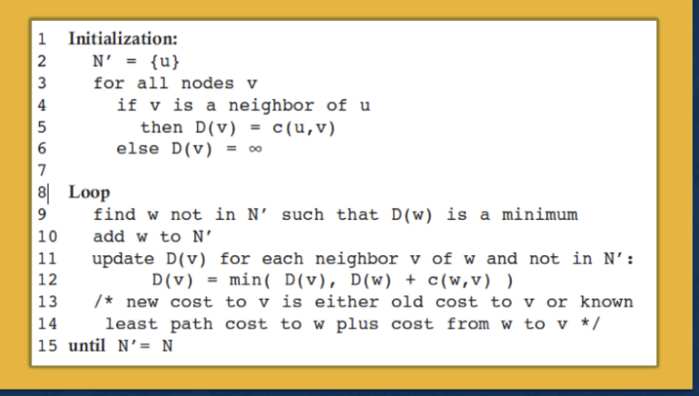
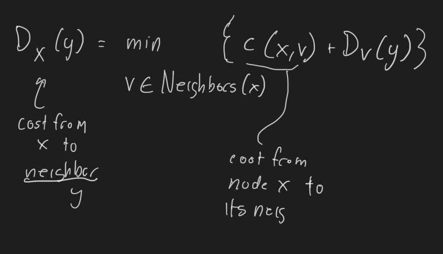
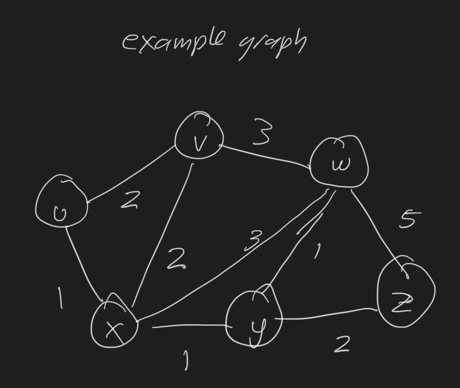
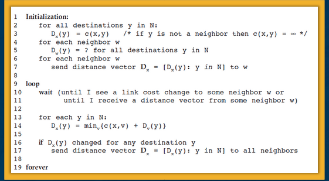

+++
date = '2025-09-07T19:39:22-04:00'
draft = false
title = '02_routing'
+++

# Routing Algorithms:

What do we mean by forwarding
- forwarding refers to transferring a packet from an incoming link to to an outgoing link through a **single** router

Routing:
- how routers work together to determine the correct/best routes/paths over which packets travel from source to destination nodes
- on the same domain, this routing is intradomain routing (IGPs, Interior Gateway Protocolss)
- on different router domains, this routing is intradomain routing

Two main classes of algorithms:
- link-state
- distance-vector

On the graph (for representating the algorithm):
- nodes are routers, edges have associated weights, which can represent:
    - length of the cable, time to traverse link, cost, link capacity
    - and current load on the link
        - weights are not static, they can change dynamically because it can depend on the load on the link
        - this can cause **pathological behavior** with **link-state **algorithms

## Zoom in Link State Routing Algorithms

### Dijikstra's Algorithm

$u$ - root node 
$v$ - any other non root node 
$D(v)$ - cost of the current **least cost path** from u to v
p(v) - previous node along the current least cost path from u -> v (temp variable)
c(u,v) - the cost form u to directly attached neighbor v
N' - subset of nodes along the current least cost path from u to v
w - loop temp variable, least cost path from previous iteration of the loop

init step:
- initialize all currently known least cost paths from u to its direct neigbors
- we know what these costs are in the beginning because they are just the costs of the immediate links (known information even in a distributed algo)
- for nodes in the network that are NOT attached to u, the root, we initialize those cost paths to infinity
- finally, initialize the N' set to be just u (root source node)

Iterations:
- after the init step, we do this for each v in the network:
- we loook at set of nodes that are not in N'
- identify a w (node), not in N', with the last cost path from the previous iteration
- then we add that node w into N'. 
- for each neigbor of v (of w), we update D(v) (cost of the least cost path from u to v) with the new cost, 
    - which is the min of 
    the old cost from u to v 
    - or D(w) + c(w,v)
- at this step we're basically testing whether adding an edge will make the distance shorter. 

Finally the algo exits by returning the shortest paths and their costs from the source node u to every other node v in the network. 

#### Computational Complexity

What's the computation complexity of the link state routing algo?
- first iter: search through all nodes to find the node with min path cost. 
- search through remaining (n-1) nodes in the rest of them. 
- after we go through all iterations, we have searched through n(n+1)/2 nodes. 
- so it's O(n^2)

## Distance Vector Routing

- iterative and distributed
    - nodes do their calculations and then send them back acorss, they dont happen in a centralized manner
    - it is asynchronous (nodes dont need to be synchronized with each other)
    - algorithm iterates until each node does not have new update to send to its neighbros
- important: each router eventually learns the full network topology
    - this is different from Dijikstra's/link-state where they don't know the network topo by the end. 

Based on Bellman Ford algorithm

- each node maintains its own distance vector, with costs to each other node in the network
- intermittently each node sends its own distance vector to its neighbor nodes
- neighbors receive distance vector and use it to update their own distance vectors

Vector update step:
- Use the Bellman Ford Equation to update the shortest distance estimate from each node x to y with:

"if I go to each of my neighbors first, and then from them to node u, which path gives me the lowest total cost?"

Notice that in the case that we're getting the distance to a nieghbor, the second term in the eqauion (D_v(y)) is 0, so we can determine distance to our neighbors in the base case :)

Example Graph:

And the algorithm in psuedocode is:

### Failures in Distance Vector Routing

- The issue is that this algorithm converges, we start convergence when there are no local changes since there are no more distance vectors being exchanged
- what happens if there are link cost changes?
- in that case, we recompute the distance vector and send the message out to our neighbors again
- the time needed for the recomputation depends on the size of the network. 
- "good news travels fast" (nieghbors don't turn down a cheaper cost)
    - when a link cost goes down, all nodes update their distance vectors quickly
- however if the new cost is higher, pathological behavior occurs (count to infinity problem)
- this is "bad news travels slow" (propogate slowly, DV has no mechamism to say "don't use me as reference, my path just got worse")
- lessons: pathologies are subtle in distributed algorithms

#### Poison Reverse: a solution to count to infinity in DV Routing

## Comparison of Link State vs Distance Vector Algorithms:
- message complexity:
    - LS: O(n^2)
    - DV: exchange between neighbors, convergence time varies (bad case vs good case)
- speed of convergence:
    - LS: O(n^2) algorithm, but may have oscillations
    - DV: convergene time varies (count to infinity problems, may have routing loops)

# Sources:

- Georgia Tech's Computer Networking course (MS in CS variant)
- https://www.youtube.com/watch?v=jJU2AVX6gpU&t=904s
- 